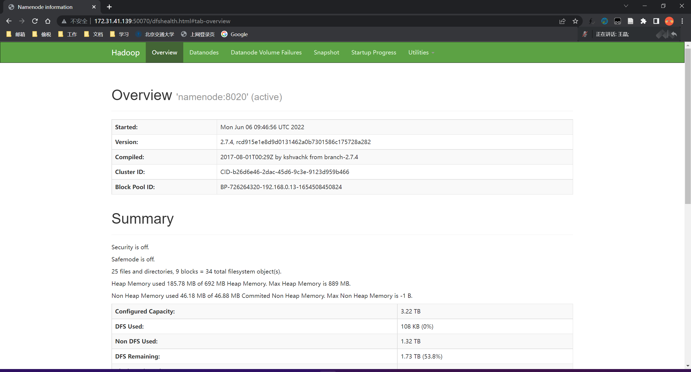
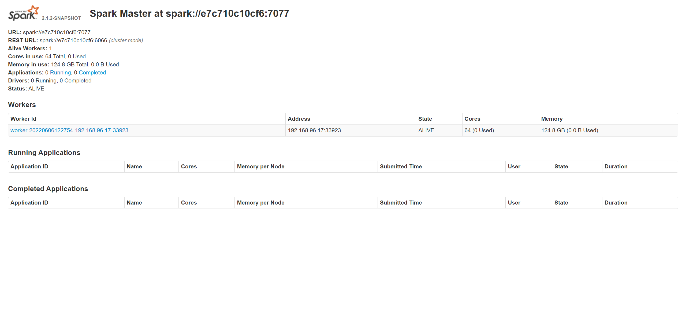

# 用docker部署大数据框架

## 部署

安装`docker compose`后，在`docker-big-data/`目录下运行以下命令即可部署，最有可能遇到的报错是端口被使用，只需要杀掉其他占用对应端口的程序或修改yml文件中映射到本机的端口号即可。

```bash
$ docker-compose up -d
```

## 测试
下面对各个组件进行测试：

- `Hadoop`

  http://172.31.41.139:50070/

  

- `Hive`

  - 进入容器

    ```bash
    $ docker-compose exec hive-server bash
    ```

  - 连接Hive

    ```bash
    # beeline -u jdbc:hive2://localhost:10000
    ```

  - 创建表

    ```bash
    0: jdbc:hive2://localhost:10000> CREATE TABLE pokes (foo INT, bar STRING);
    No rows affected (3.065 seconds)
    ```

  - 加载数据

    ```bash
    0: jdbc:hive2://localhost:10000> LOAD DATA LOCAL INPATH '/opt/hive/examples/files/kv1.txt' OVERWRITE INTO TABLE pokes;
    No rows affected (1.966 seconds)
    ```

  

- `HBase`

    1. Python连接HBase

        -  使用`happybase`包连接`HBase`时，需要进入容器打开trift服务，即如下操作

            ```bash
            $ docker-compose exec hbase-master bash
            # hbase-daemon.sh start thrift
            starting thrift, logging to /opt/hbase-1.2.6/bin/../logs/hbase-root-thrift-hbase-master.out
            ```

            然后运行如下测试代码连接hbase

            ```python
            import happybase
            
            
            connection = happybase.Connection('172.31.41.139', port=9090, autoconnect=False)
            
            connection.open()  # 打开传输
            print(connection.tables())  # 输出所有表名
            connection.close()  # 关闭传输
            ```

            得到输出

            ```bash
            [b't1']
            ```

    2. 独立测试

        - 进入容器

            ```bash
            $ docker exec -it hbase-master bash
            ```

        - 启动`hbase shell`

            ```bash
            root@hbase-master:/# hbase shell
            ```

        - 测试

            ```bash
            hbase(main):002:0> t1 = create 't1', 'f1'
            0 row(s) in 1.4100 seconds
            
            => Hbase::Table - t1
            ```

  

- `Spark`

  http://172.31.41.139:8080/

  

- `Kafka`

  使用实验二的代码：

  ```bash
  $ python producer.py 
  2022-06-06 20:31:47,684 - INFO - Connecting to Kafka......
  2022-06-06 20:31:47,684 - INFO - Broker version is too old to use automatic API version discovery. Falling back to hardcoded versions list.
  2022-06-06 20:31:47,718 - INFO - RequestHandler.stop: about to flush requests queue
  2022-06-06 20:31:47,719 - INFO - Discovered 3 brokers
  2022-06-06 20:31:47,726 - INFO - Connected.
  2022-06-06 20:31:47,726 - INFO - Connecting to Topic......
  2022-06-06 20:31:47,727 - WARNING - Topic b'event_second' not found. Attempting to auto-create.
  2022-06-06 20:31:47,875 - WARNING - Leader not available for topic 'b'event_second''.
  2022-06-06 20:31:47,875 - INFO - RequestHandler.stop: about to flush requests queue
  2022-06-06 20:31:47,990 - WARNING - Leader not available for topic 'b'event_second''.
  2022-06-06 20:31:47,990 - INFO - RequestHandler.stop: about to flush requests queue
  2022-06-06 20:31:48,104 - WARNING - Leader not available for topic 'b'event_second''.
  2022-06-06 20:31:48,105 - INFO - RequestHandler.stop: about to flush requests queue
  2022-06-06 20:31:48,217 - WARNING - Leader not available for topic 'b'event_second''.
  2022-06-06 20:31:48,217 - INFO - RequestHandler.stop: about to flush requests queue
  2022-06-06 20:31:48,335 - INFO - RequestHandler.stop: about to flush requests queue
  2022-06-06 20:31:48,335 - INFO - Topic b'event_second' successfully auto-created.
  2022-06-06 20:31:48,344 - INFO - RequestHandler.stop: about to flush requests queue
  2022-06-06 20:31:48,345 - INFO - Discovered 3 brokers
  2022-06-06 20:31:48,345 - INFO - Broker b'172.31.41.139':9094 metadata unchanged. Continuing.
  2022-06-06 20:31:48,345 - INFO - Broker b'172.31.41.139':9095 metadata unchanged. Continuing.
  2022-06-06 20:31:48,345 - INFO - Broker b'172.31.41.139':9093 metadata unchanged. Continuing.
  2022-06-06 20:31:48,345 - INFO - Discovered 1 topics
  2022-06-06 20:31:48,353 - INFO - RequestHandler.stop: about to flush requests queue
  2022-06-06 20:31:48,353 - INFO - Adding 1 partitions
  2022-06-06 20:31:48,353 - INFO - Connected.
  2022-06-06 20:31:48,353 - INFO - Starting to produce messages......
  2022-06-06 20:31:48,354 - INFO - Starting new produce worker for broker 1
  2022-06-06 20:31:48,478 - INFO - produce message: 1430622004384 693516  addtocart       297662  0
  2022-06-06 20:31:48,718 - INFO - RequestHandler worker: exiting cleanly
  2022-06-06 20:31:48,874 - INFO - RequestHandler worker: exiting cleanly
  2022-06-06 20:31:48,989 - INFO - RequestHandler worker: exiting cleanly
  2022-06-06 20:31:49,104 - INFO - RequestHandler worker: exiting cleanly
  2022-06-06 20:31:49,217 - INFO - RequestHandler worker: exiting cleanly
  2022-06-06 20:31:49,335 - INFO - RequestHandler worker: exiting cleanly
  2022-06-06 20:31:49,344 - INFO - RequestHandler worker: exiting cleanly
  2022-06-06 20:31:49,353 - INFO - RequestHandler worker: exiting cleanly
  2022-06-06 20:31:49,479 - INFO - Blocking until all messages are sent or until pending_timeout_ms
  2022-06-06 20:31:53,478 - INFO - Worker exited for broker b'172.31.41.139':9093
  2022-06-06 20:31:53,479 - INFO - Blocking until all messages are sent or until pending_timeout_ms
  2022-06-06 20:31:53,479 - INFO - Produce messages finished. Produce 1 batchs, 1 messages
  2022-06-06 20:31:53,479 - INFO - RequestHandler.stop: about to flush requests queue
  2022-06-06 20:31:53,480 - INFO - RequestHandler.stop: about to flush requests queue
  2022-06-06 20:31:53,480 - INFO - RequestHandler.stop: about to flush requests queue
  ```

  